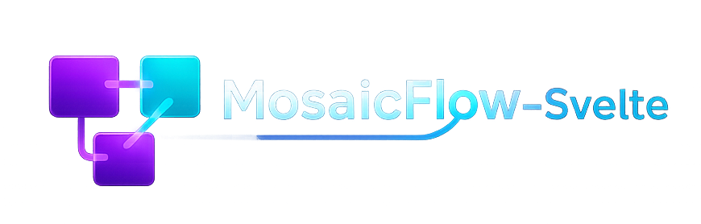

<p align="center">
  
</p>

<p align="center">
  <strong>A powerful node-based canvas for visual information mapping and research</strong>
</p>

<p align="center">
  <a href="#features">Features</a> •
  <a href="#installation">Installation</a> •
  <a href="#usage">Usage</a> •
  <a href="#node-types">Node Types</a> •
  <a href="#keyboard-shortcuts">Shortcuts</a> •
  <a href="#tech-stack">Tech Stack</a>
</p>

<p align="center">
  
  
  
  
</p>

---

## ✨ Features

### 🎨 **Visual Canvas**
- Infinite canvas with pan and zoom capabilities
- Drag & drop node creation from the sidebar palette
- Right-click context menu for quick node creation
- Smart collision detection to prevent node overlapping
- Two cursor modes: **Select** (for editing) and **Drag** (for navigation)

### 📦 **18+ Node Types**
Create rich, interconnected investigations with specialized nodes for:
- **Notes** - Rich markdown editing with live preview
- **Images** - Visual evidence with captions
- **Links** - Web references with favicons
- **Code** - Syntax-highlighted code snippets
- **Timestamps** - Flexible date/time display
- **People & Organizations** - Entity mapping
- **Domains & IPs** - Network infrastructure tracking
- **Hashes** - File integrity and threat indicators
- **Credentials** - Breach data correlation
- **Social Posts** - Social media evidence capture
- **Maps** - Geolocation data
- **Routers** - Network device information
- **Snapshots** - Webpage archival
- **Actions** - Task tracking and to-dos

### 🔗 **Connections & Relationships**
- Create edges between nodes to show relationships
- Multiple edge styles: solid, dashed, dotted, animated
- Arrow markers with customizable colors
- Label edges to describe relationships

### 📁 **Grouping & Organization**
- Group multiple nodes together with `Ctrl+G`
- Collapsible groups with customizable labels
- Font styling options for group headers
- Ungroup with `Ctrl+Shift+G`

### 🎯 **Properties Panel**
- Comprehensive node customization
- Color, border, opacity controls
- Node-specific options (timestamps, code language, etc.)
- Real-time property updates

### 💾 **Project Management**
- Save and load investigation files (.mosaic)
- Auto-save functionality
- File dialog integration

---

## 🚀 Installation

### Prerequisites
- [Node.js](https://nodejs.org/) (v18+)
- [pnpm](https://pnpm.io/) package manager
- [Rust](https://www.rust-lang.org/tools/install) (for Tauri)

### Setup

```bash
# Clone the repository
git clone https://github.com/Fanaperana/MosaicFlow-Svelte.git
cd MosaicFlow-Svelte

# Install dependencies
pnpm install

# Run in development mode
pnpm tauri dev

# Build for production
pnpm tauri build
```

---

## 📖 Usage

### Creating Nodes
1. **Drag & Drop**: Drag nodes from the left sidebar palette onto the canvas
2. **Context Menu**: Right-click on the canvas and select a node type from the menu
3. **Quick Add**: Use the toolbar buttons for common node types

### Connecting Nodes
1. Hover over a node to reveal connection handles
2. Drag from a handle to another node
3. Release to create a connection

### Organizing Your Canvas
- **Pan**: Hold `Space` + drag, or use drag mode
- **Zoom**: Scroll wheel or pinch gesture
- **Select Multiple**: Click and drag to create a selection box
- **Group**: Select nodes and press `Ctrl+G`

### Editing Properties
1. Click on a node to select it
2. Use the Properties Panel on the right to customize:
   - Colors and borders
   - Node-specific content
   - Visual styling options

---

## 🧩 Node Types

| Category | Nodes | Description |
|----------|-------|-------------|
| **Content** | Note, Image, Code, Link | Core content nodes for evidence |
| **Entities** | Person, Organization | People and company tracking |
| **Technical** | Domain, Hash, Credential, Router | Technical indicators |
| **Social** | Social Post | Social media content |
| **Utility** | Timestamp, Map, Action, Snapshot | Supporting information |
| **Organization** | Group, Link List | Grouping and collection nodes |

---

## ⌨️ Keyboard Shortcuts

| Shortcut | Action |
|----------|--------|
| `Ctrl + G` | Group selected nodes |
| `Ctrl + Shift + G` | Ungroup selected group |
| `Ctrl + S` | Save project |
| `Ctrl + O` | Open project |
| `Ctrl + N` | New project |
| `Delete` | Delete selected nodes/edges |
| `Space + Drag` | Pan canvas |
| `Escape` | Deselect all |

---

## 🛠️ Tech Stack

- **[Tauri 2.0](https://v2.tauri.app/)** - Cross-platform desktop framework
- **[SvelteKit](https://kit.svelte.dev/)** - Frontend framework with Svelte 5
- **[SvelteFlow](https://svelteflow.dev/)** - Node-based UI library
- **[TypeScript](https://www.typescriptlang.org/)** - Type-safe JavaScript
- **[Tailwind CSS](https://tailwindcss.com/)** - Utility-first styling
- **[shadcn-svelte](https://shadcn-svelte.com/)** - UI component library
- **[CodeMirror](https://codemirror.net/)** - Code editor for code nodes
- **[Lucide](https://lucide.dev/)** - Beautiful icons

---

## 📁 Project Structure

```
mosaicflow/
├── src/
│   ├── lib/
│   │   ├── components/     # Svelte components
│   │   │   ├── nodes/      # Custom node components
│   │   │   ├── ui/         # shadcn UI components
│   │   │   └── editor/     # Rich text editor
│   │   ├── stores/         # Svelte stores
│   │   ├── services/       # File operations
│   │   └── types.ts        # TypeScript definitions
│   └── routes/             # SvelteKit routes
├── src-tauri/              # Rust backend
│   ├── src/                # Rust source code
│   └── tauri.conf.json     # Tauri configuration
└── static/                 # Static assets
```

---

## 🤝 Contributing

Contributions are welcome! All work in this repo is issue-driven so every change maps to an issue and a closing commit.

- Start with an issue: open a `bug`, `feature`, `enhancement`, `refactor`, or `docs` issue describing the change and acceptance criteria.
- Branch naming: `<type>/<issue-number>-<slug>` (e.g., `feature/42-maplibre-integration`).
- Commits: use [Conventional Commits](https://www.conventionalcommits.org/) and close the issue in the footer (e.g., `Closes #42`).
- PRs: reference the issue in the title/body and keep the scope limited to that issue.
- Checks: run `pnpm check` before opening a PR.

Quick flow:
1. Fork the repository (or create a branch if you have access).
2. Create an issue describing the change.
3. Create your branch (`git checkout -b feature/42-maplibre-integration`).
4. Commit with a closing footer (`fix(stores): lock blocks dragging\n\nCloses #42`).
5. Push and open a Pull Request.

---

## 📄 License

This project is licensed under the MIT License - see the [LICENSE](LICENSE) file for details.

---

## 🙏 Acknowledgments

- [Tauri Team](https://tauri.app/) for the amazing framework
- [Svelte Team](https://svelte.dev/) for Svelte 5
- [xyflow](https://www.xyflow.com/) for SvelteFlow
- [shadcn](https://ui.shadcn.com/) for the beautiful components

---

<p align="center">
  Made with ❤️ for researchers and visual thinkers
</p>
