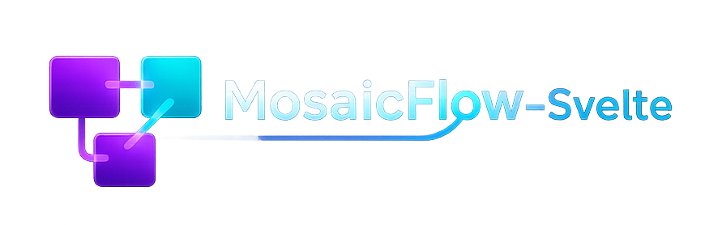
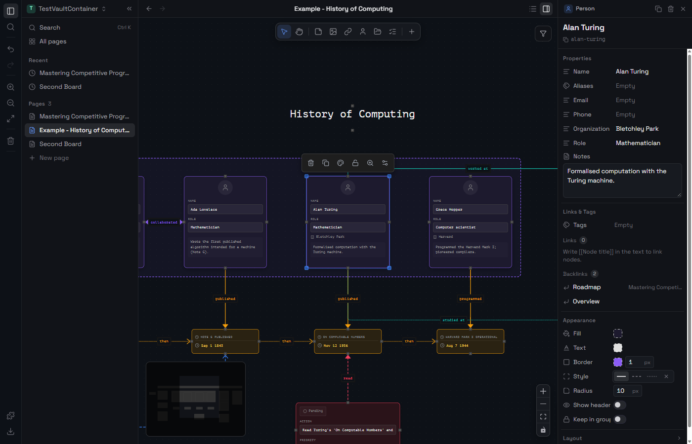
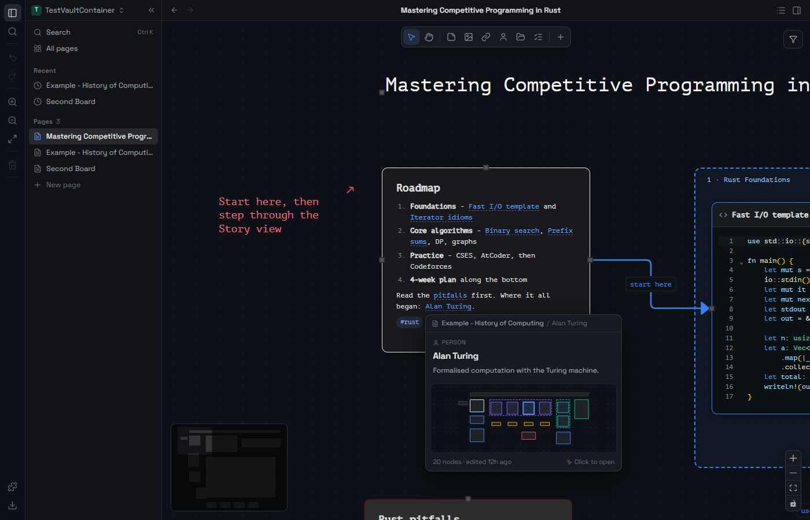
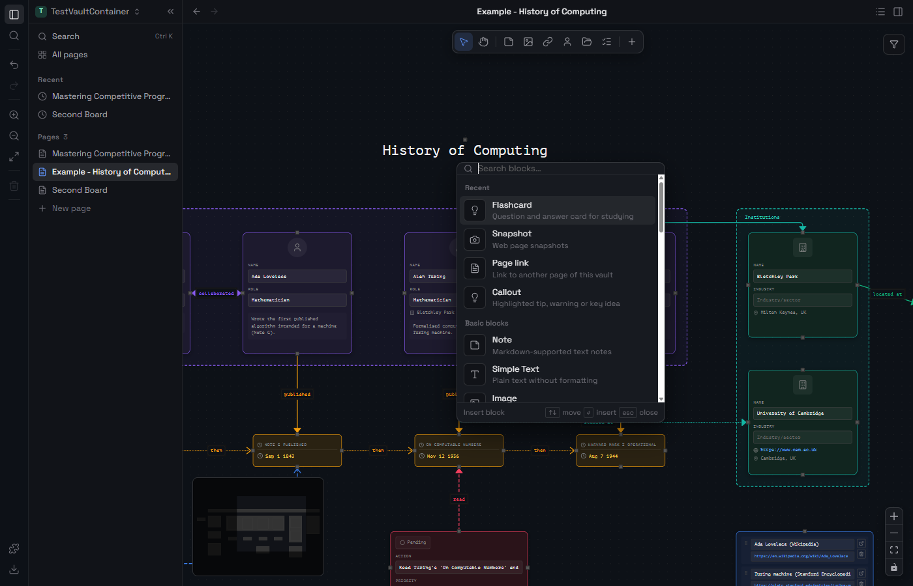
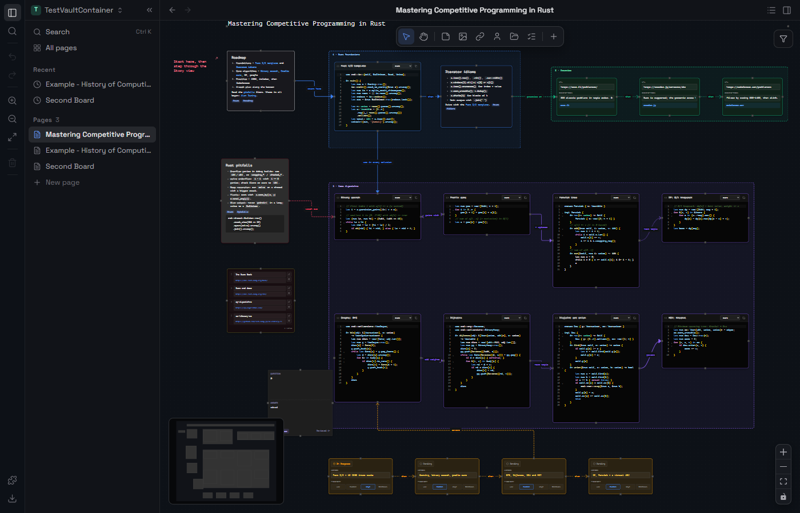
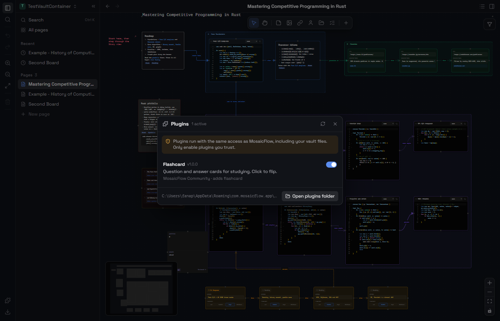

<p align="center">
  
</p>

<p align="center">
  <strong>A visual knowledge base for anyone who thinks in connections: notes, research, cases and ideas on an infinite canvas, stored as plain files you own.</strong>
</p>

<p align="center">
  <em>Built for students, researchers, clinicians, OSINT investigators, writers, analysts, product teams and anyone who wants their knowledge to stay local, searchable and portable.</em>
</p>

<p align="center">
  <a href="#who-its-for">Who it's for</a> •
  <a href="#features">Features</a> •
  <a href="#getting-started">Getting started</a> •
  <a href="#blocks">Blocks</a> •
  <a href="#keyboard-shortcuts">Shortcuts</a> •
  <a href="#plugins">Plugins</a> •
  <a href="#ai-assistants-mcp">AI / MCP</a> •
  <a href="docs/README.md">Docs</a> •
  <a href="#development">Development</a>
</p>

<p align="center">
  
  
  
  
  
</p>

<p align="center">
  
</p>

---

## Who it's for

Anyone whose knowledge is made of **things and how they relate**, and who wants to see it, not scroll through it.

| You are | MosaicFlow helps you |
|---------|----------------------|
| **Student** | Turn courses into connected study maps: notes with formulas (LaTeX) and diagrams (Mermaid), a Story view to revise step by step, timers for focus sessions and a calendar for exams. |
| **Researcher / academic** | Map literature, authors, institutions and findings; link sources across projects with `[[wikilinks]]` and backlinks; tag, search and let an AI assistant build or query maps through MCP. |
| **Doctor / clinician / health professional** | Organise clinical knowledge, protocols, differentials and study notes as linked pages. Everything stays in local files on your machine, with no account or cloud sync. |
| **OSINT / security investigator** | Build investigation boards with Person, Organization, Domain, Hash, Credential, Social post, Router, Snapshot and Map blocks, timelines, labelled relations and view-only (locked) pages for sharing findings. |
| **Journalist / analyst** | Connect people, organisations, events and sources; keep evidence and reasoning on one canvas and export it as an image or a shareable `.mosaic` package. |
| **Developer / engineer** | Sketch architectures and processes, keep code snippets with syntax highlighting, import Mermaid flowcharts and document systems next to the decisions behind them. |
| **Writer / teacher / product team / anyone curious** | Map arguments and outlines, plan and brainstorm, capture team knowledge: notes, checklists, callouts, groups and links on a canvas that grows with your ideas. |

Your vault is a folder of Markdown files, so it works offline, syncs with whatever you already use (Git, a cloud drive) and never locks your knowledge in.

---

## Features

### 🧭 Navigate like Notion and Obsidian
- **Pages sidebar**: every canvas of the vault one click away, with recent pages, inline rename and new pages, without leaving the canvas.
- **Back / forward** history (`Alt + ←/→` or mouse buttons) and a **quick switcher** (`Ctrl + K`) for pages and nodes.
- **Vault switcher** (`Ctrl + Shift + O`): jump between vaults; each one reopens the page you last used.
- **Hover previews**: hover any `[[wikilink]]`, backlink or embed to see the target node and a mini-map of its page.

<p align="center">
  
</p>

### ✍️ Add blocks the Notion way
Press <kbd>/</kbd> or double-click empty canvas space to open the block menu: type to filter, arrows to move, <kbd>Enter</kbd> to insert. Dragging a connection into empty space opens the same menu and links the new block automatically.

<p align="center">
  
</p>

### 📝 Rich notes
- **Math**: LaTeX with KaTeX, inline `$E = mc^2$` or display `$$ … $$` blocks.
- **Diagrams**: ` ```mermaid ` blocks render as flowcharts, sequence, timeline, mind-map and other diagrams.
- **Tables that format themselves**: <kbd>Tab</kbd> moves between cells and re-aligns the table as you type.
- **`/` commands inside notes**: headings, lists, tasks, code, tables, math, diagrams and links from one menu.
- Live Markdown rendering, syntax-highlighted code blocks, task lists, `[[links]]` and `#tags`.

### 🔗 A connected knowledge base
- `[[Wikilinks]]` between nodes, across pages (`[[Page#Node]]`) or to whole pages, with **backlinks** and **#tags**.
- **Stable links by id**: type `[[` in a note to browse every node in the vault and insert `[[node-id]]`, or use **Copy link** in the properties panel / right-click menu. Id links always show the node's current title, so titles can repeat and renames never break links.
- **Graph view** (`Ctrl + Alt + G`): an Obsidian-style force graph of the whole vault or the current page, colored by page; drag, zoom, search and click a node to jump to it.
- Labelled, styled edges (bezier, straight, step; solid, dashed, dotted, animated; arrow markers).
- **Groups** (`Ctrl + G`) to frame related ideas, and a **Story** view to step through a page in a chosen order.
- Vault-wide **search** across every page and node, plus a canvas filter that fades out non-matching nodes.
- **View-only pages** (`Ctrl + Shift + K` or the lock in the page header): read and follow links without accidentally moving or editing anything.

### 🎛️ Compact, Notion-style properties
Select a node or edge to edit it in a dense side panel: page-style title, typed properties, tags, links and backlinks, colors, borders, layout and locks.

### 📁 Your data, as plain files
- A **vault** is a folder; each page is a folder; each node is a **Markdown file** with frontmatter. Edit them in any editor (or let an AI agent do it) and changes sync live. The full format is in [docs/VAULT_FORMAT.md](docs/VAULT_FORMAT.md).
- **Import** `.mosaic` packages, Obsidian `.canvas`, MosaicFlow JSON, Mermaid flowcharts, or a whole folder of Markdown notes (e.g. an Obsidian vault, where `[[links]]` become edges). Drag & drop works too.
- **Export** a page or a whole vault as `.mosaic`, or a page as Obsidian canvas, JSON, PNG or SVG.

<p align="center">
  
</p>

---

## Getting started

### Prerequisites
- [Node.js](https://nodejs.org/) 18+
- [pnpm](https://pnpm.io/)
- [Rust](https://www.rust-lang.org/tools/install) and the [Tauri prerequisites](https://v2.tauri.app/start/prerequisites/) for your OS

### Run

```bash
git clone https://github.com/Fanaperana/MosaicFlow-Svelte.git
cd MosaicFlow-Svelte
pnpm install

pnpm tauri dev      # run the desktop app in development
pnpm tauri build    # build an installer
```

On first launch, create a vault (any folder) or open an existing one, then start adding blocks with <kbd>/</kbd>. The [user guide](docs/USER_GUIDE.md) covers everything else.

---

## Blocks

| Group | Blocks |
|-------|--------|
| **Basic blocks** | Note (Markdown), Simple Text, Checklist, Callout, Page link, Image, Link, Code, Iframe |
| **People & organizations** | Person, Organization, Timestamp |
| **Research & OSINT data** | Domain, Hash, Credential, Social Post, Router, Snapshot |
| **Layout & embeds** | Group, Map, Link List, Action, Annotation, Embed, Calendar, Timer |
| **Plugins** | Anything you install, e.g. the example [Flashcard](plugins/example-flashcard/) |

Highlights:
- **Note**: Markdown with live rendering, math, Mermaid diagrams, self-formatting tables, `[[wikilinks]]` and `#tags`.
- **Checklist**: tasks with progress; <kbd>Enter</kbd> adds a task, <kbd>Backspace</kbd> on an empty one removes it.
- **Callout**: tip / info / warning / danger box; click the emoji to change its style.
- **Page link**: a card linking to another page, with a live outline of it.
- **Embed**: a live, read-only copy of a node from anywhere in the vault.
- **Map**: interactive MapLibre map with markers.
- **Calendar**: month grid and upcoming list; events can repeat (daily, weekdays, weekly, monthly, yearly) and send a desktop notification before they start, from any page.
- **Timer**: countdown with presets, stopwatch with laps, and pomodoro cycles; keeps running across page switches and notifies when time is up.

---

## Keyboard shortcuts

Every shortcut can be changed in **Settings → Keyboard shortcuts** (<kbd>Ctrl</kbd> + <kbd>/</kbd>). Defaults:

| Shortcut | Action |
|----------|--------|
| <kbd>/</kbd> or double-click | Insert a block |
| <kbd>Ctrl</kbd> + <kbd>P</kbd> | Command palette (commands, templates, layouts, panels) |
| <kbd>Ctrl</kbd> + <kbd>K</kbd> / <kbd>Ctrl</kbd> + <kbd>O</kbd> | Search pages and nodes |
| <kbd>Ctrl</kbd> + <kbd>,</kbd> | Settings |
| <kbd>Ctrl</kbd> + <kbd>/</kbd> | Keyboard shortcuts |
| <kbd>Ctrl</kbd> + <kbd>N</kbd> | New page |
| <kbd>Ctrl</kbd> + <kbd>Shift</kbd> + <kbd>O</kbd> | Switch vault |
| <kbd>Ctrl</kbd> + <kbd>\\</kbd> / <kbd>Ctrl</kbd> + <kbd>Shift</kbd> + <kbd>\\</kbd> | Pages sidebar / properties panel |
| <kbd>Alt</kbd> + <kbd>←</kbd> / <kbd>→</kbd> | Back / forward between pages |
| <kbd>Ctrl</kbd> + <kbd>Alt</kbd> + <kbd>G</kbd> | Graph view |
| <kbd>Ctrl</kbd> + <kbd>Shift</kbd> + <kbd>K</kbd> | Lock / unlock page (view only) |
| <kbd>[[</kbd> in a note | Link to a node or page |
| <kbd>Shift</kbd> + <kbd>1</kbd> | Fit view |
| <kbd>Ctrl</kbd> + <kbd>=</kbd> / <kbd>Ctrl</kbd> + <kbd>-</kbd> | Zoom in / out |
| <kbd>Ctrl</kbd> + scroll / <kbd>Alt</kbd> + scroll or horizontal wheel | Pan up/down / left/right |
| <kbd>V</kbd> / <kbd>H</kbd> | Select tool / hand tool |
| <kbd>Ctrl</kbd> + <kbd>G</kbd> / <kbd>Ctrl</kbd> + <kbd>Shift</kbd> + <kbd>G</kbd> | Group / ungroup |
| <kbd>Ctrl</kbd> + <kbd>D</kbd> | Duplicate selection |
| <kbd>Ctrl</kbd> + <kbd>A</kbd> | Select all nodes |
| <kbd>Ctrl</kbd> + <kbd>Z</kbd> / <kbd>Ctrl</kbd> + <kbd>Y</kbd> | Undo / redo |
| <kbd>Delete</kbd> | Delete selection |
| <kbd>Ctrl</kbd> + <kbd>Shift</kbd> + <kbd>E</kbd> | Export as `.mosaic` |
| <kbd>Esc</kbd> | Clear selection / close menus |

## Settings

Open with the gear at the bottom of the left ribbon or <kbd>Ctrl</kbd> + <kbd>,</kbd>: **General** (hover previews, delete confirmation), **Appearance** (theme, accent color, interface scale, text size, density, corner radius, fonts, icon size/color/weight, reduced motion, custom CSS), **Canvas** (background, grid, snapping, minimap, controls), **AI / MCP** (built-in MCP server, key and client setup), **Keyboard shortcuts**, **Plugins** and **About**. Everything is saved to `settings.json` in the app data folder, so you can back it up or copy it to another machine.

---

## Plugins

Add your own blocks without rebuilding the app. Plugins live in your app data folder:

| Platform | Folder |
|----------|--------|
| Windows | `%APPDATA%\com.mosaicflow.app\plugins` |
| macOS | `~/Library/Application Support/com.mosaicflow.app/plugins` |
| Linux | `~/.local/share/com.mosaicflow.app/plugins` |

Open **Plugins** (puzzle icon at the bottom of the left ribbon) to open that folder, rescan, and switch plugins on or off. New plugins stay **disabled until you enable them**, because they run with the same access as the app.

<p align="center">
  
</p>

A plugin is a folder with a `plugin.json` and a single ES module. It can add:

| | Where it shows up |
|-|-------------------|
| **Blocks** (node types) | The `/` menu; saved as Markdown like built-in blocks |
| **Panels** | A ribbon button that opens a sidebar next to the canvas |
| **Commands** | The command palette (`Ctrl + P`) and optional shortcuts |
| **Templates** | "Insert template: …" in the palette |
| **Layouts** | "Arrange: …" in the palette |
| **Themes** | Settings → Appearance → Theme |
| **Appearance** | Read and change every appearance option (scale, text and icon size, fonts, colours, custom CSS) |
| **Settings** | Settings → Plugins |

Start from the ready-made template:

```bash
pnpm create-plugin "My Plugin" --author "Your Name"   # copies plugins/plugin-template into your plugins folder
```

Then **Plugins → Rescan**, switch it on, and edit `index.js`. A node is a few lines:

```js
export function activate(api) {
  api.registerNodeTypes([{
    type: 'hello',
    label: 'Hello',
    render(container, ctx) {
      container.textContent = `Hello from ${ctx.data.title}`;
      return { update: (next) => (container.textContent = `Hello from ${next.data.title}`) };
    },
  }]);
}
```

Plugins travel with your pages: exported `.mosaic` files include the plugins they use, and whoever imports them
is asked before they're installed. Read the [plugin guide](docs/PLUGIN_DEVELOPMENT.md), the
[API reference](docs/PLUGIN_API.md), the [starter template](plugins/plugin-template/) and the
[Flashcard example](plugins/example-flashcard/).

---

## AI assistants (MCP)

MosaicFlow includes a [Model Context Protocol](https://modelcontextprotocol.io/) server that lets any MCP-capable assistant (VS Code Copilot, Claude Code, Cursor, Claude Desktop, Windsurf, LM Studio, …) read, search and build pages directly in a vault. Changes appear live in the open app.

**1. Turn it on** in **Settings → AI / MCP**. The app serves MCP over Streamable HTTP at `http://127.0.0.1:4317/mcp` (port configurable), reachable only from your computer and only while MosaicFlow runs. Clients send a key (`mosaic_…`) as `Authorization: Bearer …`; it stays the same until you regenerate it.

**2. Connect your assistant.** The settings page shows a ready-to-copy snippet for each client, for example:

<details open>
<summary>VS Code (Copilot agent mode) — <code>.vscode/mcp.json</code> or the user <code>mcp.json</code></summary>

```json
{
  "servers": {
    "mosaicflow": {
      "type": "http",
      "url": "http://127.0.0.1:4317/mcp",
      "headers": { "Authorization": "Bearer mosaic_…" }
    }
  }
}
```
</details>

<details>
<summary>Claude Code</summary>

```bash
claude mcp add --transport http mosaicflow http://127.0.0.1:4317/mcp --header "Authorization: Bearer mosaic_…"
```
</details>

<details>
<summary>Claude Desktop, Cursor and other clients</summary>

Cursor takes the same `url` and `headers` in `~/.cursor/mcp.json` (under `mcpServers`). Claude Desktop only starts local commands, so it connects through the [mcp-remote](https://www.npmjs.com/package/mcp-remote) bridge (needs Node.js); the settings page generates that config too. For clients that only accept a URL, enable **Allow key in URL** to get `…/mcp?token=mosaic_…`.
</details>

<details>
<summary>Without the app running (stdio)</summary>

`packages/mcp-server` is the same server as a standalone command that works directly on the vault files, even when MosaicFlow is closed. Build it once (only Node.js 20+ is needed to run it):

```bash
pnpm install
pnpm --filter @mosaicflow/mcp-server build
# -> packages/mcp-server/dist/mosaicflow-mcp.mjs
```

Then point your client at it, replacing both paths:

```json
{
  "mcpServers": {
    "mosaicflow": {
      "command": "node",
      "args": ["C:/path/to/MosaicFlow-Svelte/packages/mcp-server/dist/mosaicflow-mcp.mjs", "E:/MosaicVault/MyVault"]
    }
  }
}
```

VS Code uses `"servers"` with `"type": "stdio"` instead of `"mcpServers"`. The vault can also be passed as the `MOSAICFLOW_VAULT` environment variable instead of the second argument.
</details>

**3. Ask for knowledge, or ask your knowledge.** For example: *"Build a MosaicFlow knowledge map about the history of cryptography, with people, algorithms and a timeline."* or *"What do my notes say about shortest paths?"* The server tells the model to look things up in the vault before answering and to cite the pages and nodes it used. Clients that support MCP prompts also offer **knowledge_map** (build a map) and **ask_vault** (answer from your notes).

| Tool | What it does |
|------|--------------|
| `get_guide` | Node types, fields, palette and layout rules (called first) |
| `build_knowledge` | Creates a whole map in one call: page, groups, nodes, labelled edges, auto layout and story order |
| `search`, `read_nodes`, `get_links`, `list_tags` | Find notes (strict, or `match: "any"` for questions), read their full text with links and backlinks, follow `#tags` |
| `list_canvases`, `read_canvas` | List pages and read a whole page |
| `create_canvas`, `update_canvas`, `delete_canvas` | Create pages; rename, describe, tag, lock/unlock or delete them |
| `create_node`, `update_node`, `delete_node` | Edit nodes (rename with `update_node`; ids never change) |
| `connect`, `update_edge`, `delete_edge` | Edit edges |
| `create_group`, `set_story_order`, `auto_layout`, `import_mermaid` | Structure and tidy a page |

Open the vault in MosaicFlow once before connecting so `.mosaicflow/node-types.json` exists; it tells the assistant which node types and fields are available. Agents without MCP can edit the files directly by following [docs/VAULT_FORMAT.md](docs/VAULT_FORMAT.md).

---

## Development

### Tech stack
- **[Tauri 2](https://v2.tauri.app/)** + **Rust** for the desktop shell, file access and vault services
- **[SvelteKit](https://kit.svelte.dev/)** with **Svelte 5 runes** and **TypeScript**
- **[Svelte Flow](https://svelteflow.dev/)** for the canvas
- **[Tailwind CSS v4](https://tailwindcss.com/)**, [bits-ui](https://bits-ui.com/), [Lucide](https://lucide.dev/) icons
- **[CodeMirror](https://codemirror.net/)** editors and **[MapLibre GL](https://maplibre.org/)** maps

### Project structure

```
MosaicFlow-Svelte/
├── src/                     # SvelteKit app
│   ├── lib/components/      # Canvas, sidebars, panels, node components
│   ├── lib/kernel/          # Plugin loader and registries
│   ├── lib/plugins/         # Built-in plugins (core node sets)
│   ├── lib/stores/          # Svelte 5 rune stores (workspace, vault, pages, plugins…)
│   └── lib/services/        # Navigation, import/export, file services
├── packages/
│   ├── node-*/              # Built-in node types, one package each
│   ├── node-sdk/            # Shared node building blocks
│   ├── vault-core/          # Vault format, Markdown codec, knowledge index, importers
│   └── mcp-server/          # MCP server for AI assistants
├── plugins/example-flashcard/  # Example user plugin
├── crates/                  # Shared Rust crates
├── src-tauri/               # Tauri app (Rust commands and services)
└── docs/                    # Architecture, API and plugin docs
```

### Checks

```bash
pnpm check                                   # svelte-check / TypeScript
pnpm --filter ./packages/vault-core exec vitest run   # vault-core unit tests
cd src-tauri && cargo check                  # Rust
```

### Releasing and code signing

Bump `version` in `src-tauri/tauri.conf.json`, then push a matching tag (`git tag v0.2.0 && git push origin v0.2.0`). The [Release workflow](.github/workflows/release.yml) runs the CI checks, then builds six installers into one **draft** GitHub release with a download table:

| System | x64 | ARM64 |
|--------|-----|-------|
| Windows | `.exe` (NSIS) and `.msi` | `.exe` (NSIS) |
| macOS | `.dmg` (Intel) | `.dmg` (Apple Silicon) |
| Linux | `.AppImage`, `.deb`, `.rpm` | `.AppImage`, `.deb`, `.rpm` |

Review the draft, then publish it. Each platform is signed when its secrets are set, and built unsigned (with a warning in the log) when they aren't.

| Platform | Signing | Repository secrets (Settings → Secrets and variables → Actions) |
|----------|---------|----------------------------------------------------------------|
| macOS | Developer ID certificate + notarization (Apple Developer Program). Without it: ad-hoc signature, users allow the app in Privacy & Security | `APPLE_CERTIFICATE` (base64 `.p12`), `APPLE_CERTIFICATE_PASSWORD`, `APPLE_SIGNING_IDENTITY`; for notarization `APPLE_ID`, `APPLE_PASSWORD` (app-specific password), `APPLE_TEAM_ID` |
| Windows | [Azure Artifact Signing](https://v2.tauri.app/distribute/sign/windows/#azure-artifact-signing). Without it: SmartScreen warns on download | Secrets `AZURE_CLIENT_ID`, `AZURE_CLIENT_SECRET`, `AZURE_TENANT_ID`; variables `AZURE_SIGNING_ENDPOINT`, `AZURE_SIGNING_ACCOUNT`, `AZURE_SIGNING_PROFILE` |
| Linux | Not required | |

See the Tauri guides for [macOS](https://v2.tauri.app/distribute/sign/macos/) and [Windows](https://v2.tauri.app/distribute/sign/windows/) for how to get the certificates.

More in [docs/](docs/README.md): the [user guide](docs/USER_GUIDE.md), [architecture](docs/ARCHITECTURE.md), [internal API](docs/API.md), [vault format](docs/VAULT_FORMAT.md) and [plugin guide](docs/PLUGIN_DEVELOPMENT.md).

---

## Contributing

Contributions are welcome! Work in this repo is issue-driven, so every change maps to an issue and a closing commit.

- **Start with an issue** (`bug`, `feature`, `enhancement`, `refactor` or `docs`) describing the change and its acceptance criteria.
- **Branch**: `<type>/<issue-number>-<slug>`, e.g. `feature/42-maplibre-integration`.
- **Commits**: [Conventional Commits](https://www.conventionalcommits.org/), closing the issue in the footer (`Closes #42`).
- **PRs**: reference the issue and keep the scope to it; run `pnpm check` first.

See [CONTRIBUTING.md](CONTRIBUTING.md) for details.

---

## License

MIT; see [LICENSE](LICENSE).

## Acknowledgments

[Tauri](https://tauri.app/), [Svelte](https://svelte.dev/), [xyflow](https://xyflow.com/), [shadcn-svelte](https://shadcn-svelte.com/) and [MapLibre](https://maplibre.org/), and the Notion and Obsidian teams for the inspiration.

<p align="center">
  Made with ❤️ for students, researchers, clinicians, investigators and every curious mind that thinks in connections
</p>
